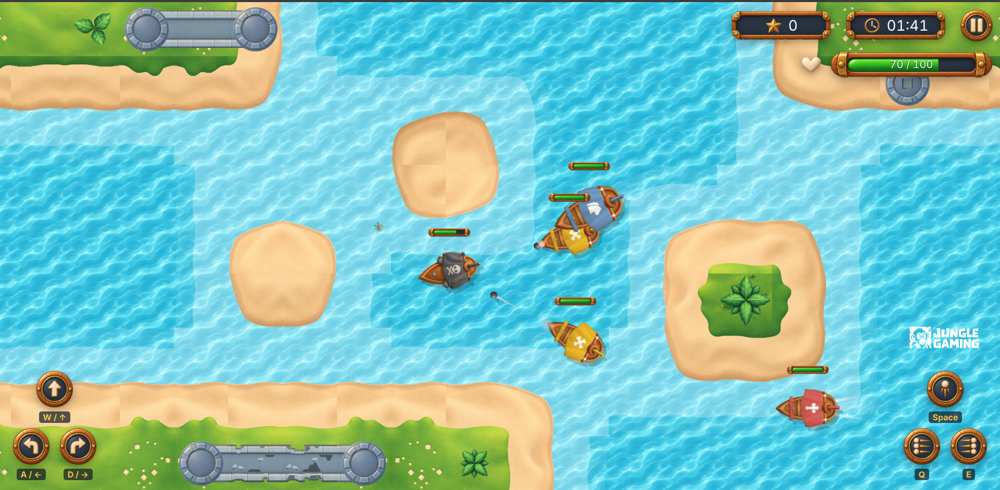
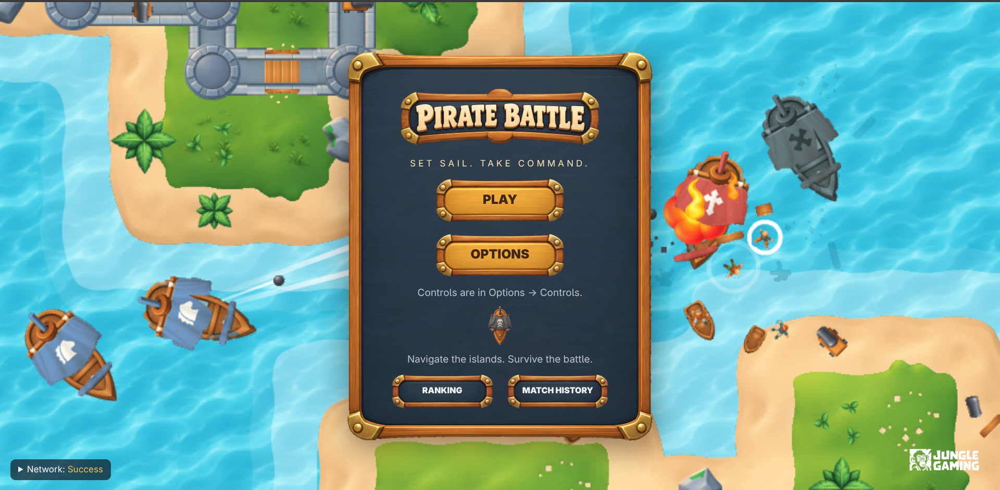
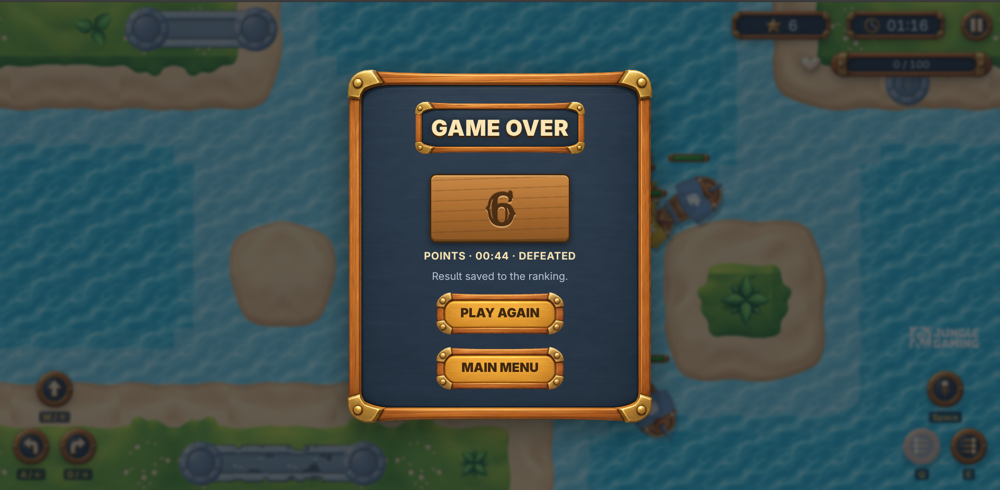
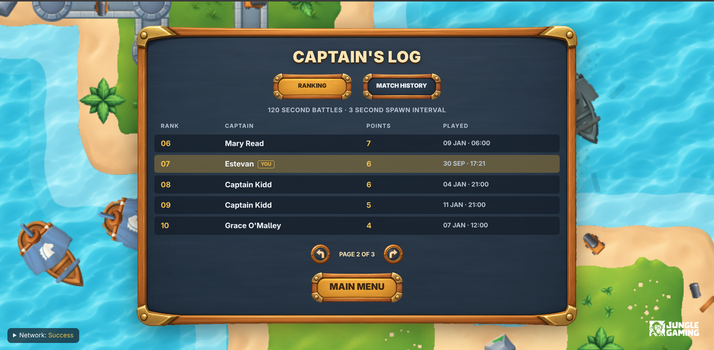
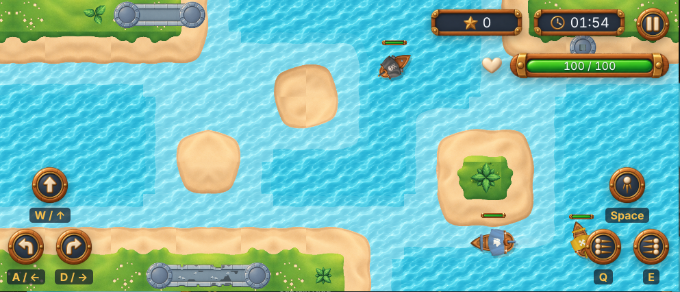

# 🏴‍☠️ Pirate Battle

A 2D top-down naval shooter that runs entirely in the browser. Sail between islands, sink enemy ships and climb the ranking before time runs out.


**🔗 Play it:** <!-- TODO: deploy URL --> _coming soon_

[](public/assets/demo/demo.mp4)

▶️ [Watch the gameplay video](https://github.com/user-attachments/assets/723cad0c-c828-4875-9c52-938144300c1e)

## Table of contents

- [About](#about)
- [Features](#features)
- [Screenshots](#screenshots)
- [Controls](#controls)
- [Getting started](#getting-started)
- [Environment variables](#environment-variables)
- [Commands](#commands)
- [Gameplay configuration](#gameplay-configuration)
- [Network scenarios (MSW)](#network-scenarios-msw)
- [Tests](#tests)
- [Tech stack](#tech-stack)
- [Architecture](#architecture)
- [Performance](#performance)
- [Credits](#credits)
- [Author](#author)

## About

Pirate Battle was built for a front-end game development challenge. The game core (simulation, physics, rendering) is plain TypeScript + PixiJS, and the menus, HUD and screens are React. The ranking and match history are REST APIs mocked with MSW, so the whole app, including its "backend", runs in the browser with no server.

**Status:** ✅ core gameplay complete · 🚧 deploy pending

## Features

- ⚓ **Three enemy types:** Chaser (rams you), Shooter and Big Shooter (keep their distance and fire).
- 💥 **Three weapons:** front cannon and left/right broadsides, each with its own cooldown.
- ❤️ **Health and repair:** ships show damage as they lose HP; every 3 kills repairs 10 HP.
- 🏝️ **Island collisions** on a hand-made Mediterranean map.
- ⏸️ **Pause** manually or automatically when the tab loses focus.
- 🏆 **Ranking and match history**, paginated and grouped by match settings.
- 📡 **Resilient saving:** results that fail to save stay queued and are resent after a refresh.
- 📱 **Desktop and mobile**, with on-screen touch controls.
- ♿ **Accessible:** keyboard navigation, visible focus, screen-reader announcements for score and time.
- 🧪 **Network failure scenarios** to test slow, broken or out-of-order APIs.

## Screenshots

| Main menu                                 | Gameplay                                             |
| ----------------------------------------- | ---------------------------------------------------- |
|  |          |
| **Result**                                | **Captain's Log (ranking / history)**                |
|   |  |
| **Mobile**                                |                                                      |
|   |                                                      |

## Controls

| Action            | Keyboard  |
| ----------------- | --------- |
| Sail forward      | `W` / `↑` |
| Turn left         | `A` / `←` |
| Turn right        | `D` / `→` |
| Fire front cannon | `Space`   |
| Fire left side    | `Q`       |
| Fire right side   | `E`       |
| Pause / resume    | `Esc`     |

On touch devices, use the on-screen buttons: movement at the bottom left, weapons at the bottom right. You can move and fire at the same time. **Landscape** is recommended on phones.

## Getting started

**Requirements:** Node.js 20+ and npm.

```bash
git clone https://github.com/Estenvanos/challenge-pirate-battle.git
cd challenge-pirate-battle
npm ci
cp .env.example .env
npm run dev
```

Open http://localhost:8080.

## Environment variables

| Variable              | Default | Description                                                                                      |
| --------------------- | ------- | ------------------------------------------------------------------------------------------------ |
| `VITE_API_BASE_URL`   | `/api`  | Base URL of the ranking/history API. Keep it relative so MSW can intercept it.                   |
| `VITE_API_TIMEOUT_MS` | `8000`  | HTTP request timeout (ms).                                                                       |
| `VITE_GAME_TEST`      | unset   | Set to `true` by Playwright only. Enables the `window.__GAME_TEST__` hooks (seed, clock, state). |

## Commands

| Command                      | What it does                                                     |
| ---------------------------- | ---------------------------------------------------------------- |
| `npm run dev`                | Dev server on port 8080                                          |
| `npm run build`              | Lint + typecheck + production build (`dist/`)                    |
| `npm run preview`            | Serve the production build locally (port 4173)                   |
| `npm run lint`               | ESLint + Prettier                                                |
| `npm run format`             | Format every file with Prettier (`format:check` only checks)     |
| `npm run typecheck`          | TypeScript check (`tsc --noEmit`)                                |
| `npm run test:e2e`           | Playwright E2E tests (Chromium desktop + mobile)                 |
| `npm run test:visual`        | Visual regression (menu, arena, result)                          |
| `npm run test:visual:update` | Regenerate the visual baselines                                  |
| `npm run test:report`        | Open the last Playwright HTML report                             |
| `npm run profile`            | 3-minute performance profile + memory cycles (`docs/profiling/`) |

First time running the tests: `npx playwright install chromium`.

## Gameplay configuration

In **Options** you can change:

| Option            | Min  | Max   | Step | Default |
| ----------------- | ---- | ----- | ---- | ------- |
| Game session time | 60 s | 180 s | 10 s | 120 s   |
| Enemy spawn time  | 1 s  | 10 s  | 1 s  | 3 s     |

Options are saved in the browser, and the ranking only compares matches played with the same settings. All balancing values (speed, HP, damage, cooldowns) live in [`src/config/gameConfig.ts`](src/config/gameConfig.ts); the reasoning behind them is in [ARCHITECTURE.md §11](ARCHITECTURE.md#11-balancing-decisions).

## Network scenarios (MSW)

The ranking and history APIs are mocked with MSW, also in the published build. You can make them fail on purpose.

**Select a scenario** in either way:

- open the **Scenario panel** at the bottom left of any screen (except during a match), or
- add `?scenario=<id>` to the URL, e.g. `http://localhost:8080/?scenario=slow`.

The page reloads and the choice is remembered.

| Id                  | Behaviour                                      |
| ------------------- | ---------------------------------------------- |
| `success`           | Default, no delay                              |
| `empty`             | No fixture data                                |
| `manyPages`         | Lots of data to test pagination                |
| `slow`              | Every request waits 2.5 s                      |
| `variableLatency`   | 200–2000 ms per request (reproducible)         |
| `outOfOrder`        | Responses arrive out of order                  |
| `timeout`           | Never answers (request times out after 8 s)    |
| `networkError`      | Connection failure                             |
| `clientError`       | HTTP 400 (not retried)                         |
| `serverError`       | HTTP 500 (retried)                             |
| `rankingDown`       | Only the ranking fails                         |
| `historyDown`       | Only the history fails                         |
| `timeoutAfterWrite` | Match is saved, but the response never arrives |
| `downAtMatchEnd`    | Saving a match always fails                    |

**Reset:** click **Reset mock data** in the Scenario panel. It clears saved matches, the pending queue, the last result and the scenario.

### Reproducing failures

- **Lost save, then recovery:** open `?scenario=downAtMatchEnd`, play a match to the end. The result shows the save failed and the menu shows a pending record. Switch to `success` → it is resent on reload (or click **Try again**).
- **No duplicates on retry:** open `?scenario=timeoutAfterWrite`, finish a match, retry. The record appears only once.
- **Error states:** open `?scenario=rankingDown` or `historyDown`, then the **Captain's Log**.
- **Loading and races:** use `slow` or `outOfOrder` and switch pages quickly in the Captain's Log.

## Tests

End-to-end tests use Playwright on Chromium, desktop and mobile (touch). Matches use a fixed seed and a manually controlled clock, so the tests are reproducible. Each failing test keeps a trace and a screenshot, and an HTML report is generated in `playwright-report/`.

```bash
npm run test:e2e                          # all tests
npx playwright test tests/e2e/combat.spec.ts  # one file
npm run test:report                       # open the report
```

Specs live in [`tests/e2e`](tests/e2e) (one spec per required test area) and [`tests/visual`](tests/visual) (visual regression, baselines in `tests/visual/__snapshots__`). Playwright starts its own dev server on port 4173 with `VITE_GAME_TEST=true`, which adds the `window.__GAME_TEST__` hooks: `?seed=N` for the match seed, a manual clock the tests advance step by step, and read-only state. The game is still played through the real keyboard and touch controls. The full suite takes about 4 minutes.

## Tech stack

| Technology     | Role                                       |
| -------------- | ------------------------------------------ |
| React          | Menus, HUD and screens                     |
| TypeScript     | Strict mode across the codebase            |
| PixiJS 8       | Game rendering                             |
| TanStack Query | Ranking and history state (cache, retries) |
| Axios          | HTTP client                                |
| Zod            | API contracts and runtime validation       |
| MSW            | Mocked REST APIs                           |
| Playwright     | E2E and visual regression tests            |
| Vite           | Dev server and build                       |

## Architecture

The game core (`src/game`) has no React dependency: it runs a fixed-timestep simulation and PixiJS draws it. React reads throttled snapshots of the game state, so it never re-renders every frame.

Full details (React/PixiJS integration, simulation loop, collisions, resource management, persistence, ranking contracts and cache) are in [ARCHITECTURE.md](ARCHITECTURE.md).

## Performance

Measured on a production build (Intel i5-10210U with integrated UHD Graphics, Chromium 153, 1280×720): a full 3-minute match at the default spawn rate runs at **60 FPS** with a **p95 frame time of 16.8 ms**, up to 44 enemies on screen. Five play-and-exit cycles leave no extra canvases, DOM nodes or listeners behind. Method, raw data and limitations: [`docs/profiling/`](docs/profiling/README.md).

## Credits

The game uses the art and sound pack provided with the challenge. Extra assets (parrot sounds, the Rye font, heal effects) and their licences are listed in [CREDITS.md](CREDITS.md).

## Author

**Estevan** · [GitHub](https://github.com/Estenvanos) <!-- TODO: LinkedIn / email -->
